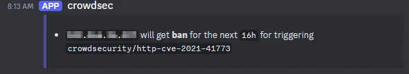

# Traefik Reverse Proxy with Crowdsec WAF

This project provides a deployment and configuration guide for a reverse proxy setup designed to serve all web applications on a server. The reverse proxy handles critical tasks such as certificate creation and renewal, ensures secure communication by redirecting all HTTP traffic to HTTPS, and serves a robots.txt file at /robots.txt for all routes and applications. Additionally, it integrates CrowdSec as a Web Application Firewall (WAF) to enhance security by analyzing traffic and blocking malicious requests, offering a robust and scalable solution for managing web services.

## Components

### Traefik

Traefik reverse proxy is used to serve all the web apps on the server and is also responsible for certificate creation and renewal. It also redirects all HTTP traffic to HTTPS.

#### How to Expose a Service

To create a new service and expose it with Traefik, it must be in the traefik network and add these labels in a docker-compose:

```yaml
    labels:
      - "traefik.enable=true"
      - "traefik.docker.network=traefik"
      - "traefik.http.services.FIXME.loadbalancer.server.port=80"
      - "traefik.http.routers.FIXME.rule=Host(`FIXME.${TOP_DN}`)"
      - "traefik.http.routers.FIXME.tls.certresolver=le"
```


#### Auto Certificates with Let's Encrypt

For Let's Encrypt, I use the Gandi DNS challenge with the key stored in the `.env` file, but you can use a different method by modifying the configuration in the `docker-compose.yml`. You can find more details in the [reference documentation](https://doc.traefik.io/traefik/https/acme/).

#### HTPASSWORD generation for traefik admin page

To generate the content for the `HTPASSWORD` variable to place in the `.env` file and protect the admin page, use:

```sh
echo "fixme_my_user:$(openssl passwd -apr1 'fixme_my_password')"
```

#### Log Rotation

Not yet done, but be aware that Traefik access logs are mounted in `./log/traefik/access.log` to allow CrowdSec to access them. Therefore, it might be necessary to implement a mechanism to rotate and manage them.

### Robots

This WAF also exposes a `robots.txt` file on all running routers at the top level, accessible at `HOSTNAME/robots.txt`.

### Crowdsec

CrowdSec is an open-source cybersecurity platform that detects and blocks malicious behavior in real time, sharing anonymized threat intelligence with a global community. Lightweight, easy to use, and compatible with various systems.

In this setup, the engine runs in a container and parses Traefik access logs to detect threats. The bouncer, responsible for blocking requests from banned hosts, is a [Traefik plugin](https://plugins.traefik.io/plugins/6335346ca4caa9ddeffda116/crowdsec-bouncer-traefik-plugin) that communicates with the engine.

The setup is inspired by the [CrowdSec documentation](https://docs.crowdsec.net/docs/intro/) and [this blog article](https://www.crowdsec.net/blog/enhance-docker-compose-security).

#### Setup

1. Copy `.env.example` to `.env` and set all values except `CS_BOUNCER_KEY_TRAEFIK` and `CS_DISCORD_WEBHOOK`, which will be generated later. Refer to the previous sections for instructions on setting up the `HTPASSWORD` and Let's Encrypt ACME challenge.
2. Create a [Discord webhook](https://support.discord.com/hc/en-us/articles/228383668-Intro-to-Webhooks) and set it in `CS_DISCORD_WEBHOOK` in the `.env` file.
3. Start the services
   ```sh
   docker compose up -d
   ```
4. Create an account on [CrowdSec](https://app.crowdsec.net/).
5. Enroll the engine by following [this documentation](https://docs.crowdsec.net/u/getting_started/post_installation/console/#your-first-enrollment) and running:
   ```sh
   docker exec crowdsec cscli console enroll XXXXX
   ```
6. Restart the CrowdSec service.
   ```sh
   docker compose restart crowdsec
   ```
7. Create a bouncer key with:
   ```sh
   docker exec crowdsec cscli bouncers add traefik-bouncer
   ```
   Then set the key in the `CS_BOUNCER_KEY_TRAEFIK` variable in the `.env` file.
8. Restart all services.
   ```sh
   docker compose down
   docker compose up -d
   ```

#### Test Notifications

To test Discord notifications, run:

```sh
docker exec crowdsec cscli notifications test discord
```

#### Show decissions

```sh
docker compose exec crowdsec cscli decision list
```

```
╭────────┬──────────┬─────────────┬───────────────────────────────────────┬────────┬─────────┬───────────────────────────────────────────────────────┬────────┬────────────┬──────────╮
│   ID   │  Source  │ Scope:Value │                 Reason                │ Action │ Country │                           AS                          │ Events │ expiration │ Alert ID │
├────────┼──────────┼─────────────┼───────────────────────────────────────┼────────┼─────────┼───────────────────────────────────────────────────────┼────────┼────────────┼──────────┤
│ 208206 │ crowdsec │ Ip:....     │ crowdsecurity/CVE-2017-9841           │ ban    │ US      │ 45102 Alibaba US Technology Co., Ltd.                 │ 1      │ 18h55m56s  │ 54       │
│ 156376 │ crowdsec │ Ip:....     │ crowdsecurity/http-probing            │ ban    │ PT      │ 12353 Vodafone Portugal - Communicacoes Pessoais S.A. │ 11     │ 15h21m4s   │ 48       │
│ 156374 │ crowdsec │ Ip:....     │ crowdsecurity/thinkphp-cve-2018-20062 │ ban    │ SG      │ 45102 Alibaba US Technology Co., Ltd.                 │ 1      │ 31h20m12s  │ 46       │
│ 156370 │ crowdsec │ Ip:....     │ crowdsecurity/http-probing            │ ban    │ GB      │ 202306 Hostglobal.plus Ltd                            │ 11     │ 22h43m2s   │ 42       │
│ 138806 │ crowdsec │ Ip:....     │ crowdsecurity/thinkphp-cve-2018-20062 │ ban    │ SG      │ 45102 Alibaba US Technology Co., Ltd.                 │ 1      │ 29h39m0s   │ 38       │
│ 138802 │ crowdsec │ Ip:....     │ crowdsecurity/thinkphp-cve-2018-20062 │ ban    │ SG      │ 45102 Alibaba US Technology Co., Ltd.                 │ 1      │ 29h6m8s    │ 34       │
│ 138798 │ crowdsec │ Ip:....     │ crowdsecurity/thinkphp-cve-2018-20062 │ ban    │ SG      │ 45102 Alibaba US Technology Co., Ltd.                 │ 1      │ 27h57m42s  │ 30       │
│ 123794 │ crowdsec │ Ip:....     │ crowdsecurity/thinkphp-cve-2018-20062 │ ban    │ SG      │ 45102 Alibaba US Technology Co., Ltd.                 │ 1      │ 26h23m17s  │ 25       │
╰────────┴──────────┴─────────────┴───────────────────────────────────────┴────────┴─────────┴───────────────────────────────────────────────────────┴────────┴────────────┴──────────╯
```

#### Ban time setup

Edit `duration_expr` in `crowdsec-profile.yaml`

#### Discord Notification format

Edit `crowdsec-discord.yaml`  For the formating, [this doc](https://discordjs.guide/popular-topics/embeds.html#using-an-embed-object) is a good reference.

Here an example of the result:


